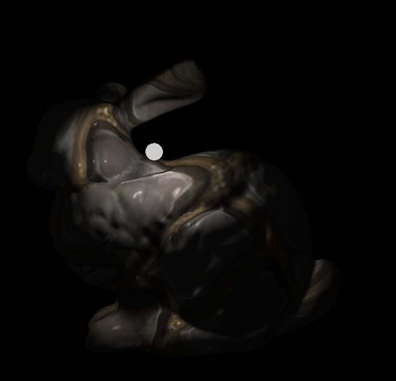
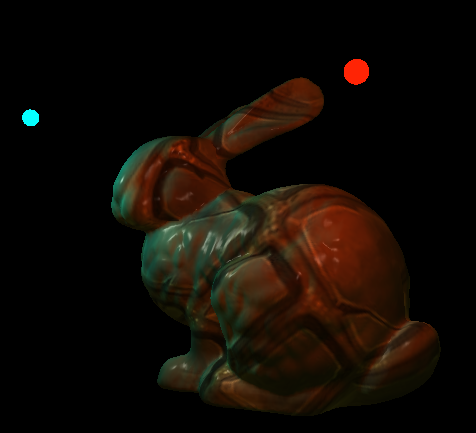
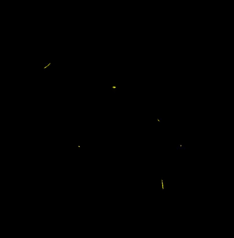
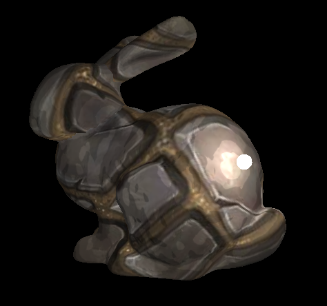

# Introduction

The second assignment of NCTU Computer Graphics 2018(Fall).  To implement three effects via shader program: phone-shading, dissolving, ramp. The [report file](https://github.com/ds282547/2018_NCTU-CG_HW2/blob/main/HW2_Report.pdf) shows the details. 

# Result

### Phone shading 
 

### Dissolving

### Ramp

